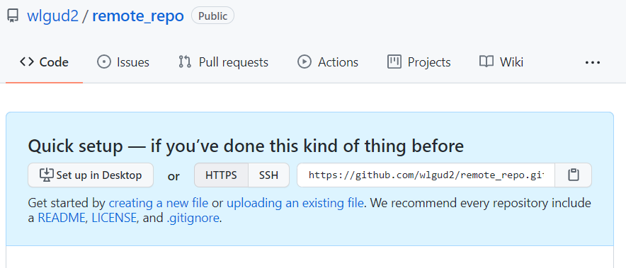
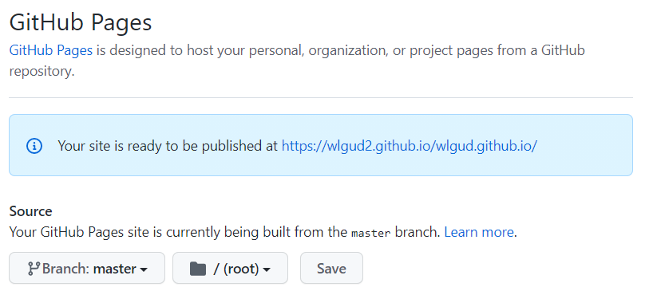

# Git

> 분산 <u>버전 관리</u> 시스템

- 버전 관리
  - 코드의 히스토리(버전)을 관리하는 도구

  - 개발되어온 과정 파악 가능

  - 이전 버전과의 변경 사항 비교 및 분석

- 분산
  - 중앙 집중 (은행)
  - 분산형 (블록체인, 같은 정보를 여러 사람이 나눠 갖고 있음)

- 깃은 **변경사항**만을 저장

---

#### **깃허브**

> 깃 기반의 저장소 서비스

- git bash here: 명령어 실행기. unix/linux 명령어 사용 가능

  *깃은 명령어를 통해서 사용*

- CLI(Command - Line Interface) <> GUI(Graphic user interface)

- VSCODE-new terminal로 명령프롬포트 사용 가능

  *+옆의 드롭다운-> git bash-> unix, linux 명령어 사용 가능*

- 바탕화면 우클릭-git bash here로 바탕화면에서 git bash 열 수 있다

##### 간단한 Unix/Linux 명령어

- 현재 위치의 폴더, 파일 목록 보기	ls
- 현재 위치 이동하기	cd <path> / cd .. <이전 위치로 돌아가기
- ~ <<home 디렉토리(로컬디스크c, 사용자, mulan)를 나타낸다
- 폴더 생성하기	mkdir cli_test
- 파일 생성하기	touch test.txt
- 파일 삭제	rm test.txt	// 폴더 삭제	rm -r cli_test


README.md(): 프로젝트 설명 파일 꼭 형성해주기

- 특정 버전으로 남긴다 = "**커밋(Commit)**한다"

- **커밋**은 세가지 영역을 바탕으로 동작
  - Working Directory작업하고 있는 실제 디렉토리(.git이 있는 디렉토리)

  - Staging Area	커밋으로 남기고 싶은, 특정 버전으로 관리하고 싶은 파일이 있는 곳

  - Repository	커밋이 저장되는 곳. 특정 디렉토리를 **버전 관리**하는 저장소

- **git init**	로컬 저장소(local repository)를 생성하는 명령어(.git 생성)

  폴더에서 우클릭->git bash here -> git init
  
  git init Initialized empty Git repository in ~ //~에 빈 저장소를 생성하였다


---


---


- **git status**	git의 현재 상태	git add하기 전엔 untracked files 뜬다

- **git add** BasicCar.py README.md // git add . <<모든 파일을 staging area로 올림

- **git config** --*global* user.email "akddnfsla@gmail.com"

  *git config --global user.name "깃허브아이디"*

​		**global**: 전 역에서 쓸 수 있다 // <>local

- **git commit** -m "커밋 이름"

  ​						*m	커밋 메세지. 버전의 제목*

- git add에서 basiccar와 readme 모두 staging area에 올렸다면, commit 파일에 두 파일의 수정 사항이 다 저장됨
  - basiccar만 staging area에 올렸다면, 커밋 시 하나만 저장
  
    

- working tree clean 		이전 커밋된 결과에서 변경된 사항 없음
- **git log**   git의 commit history 보기	*빠져나가기: q*
- **git diff**  두 commit 간 차이 보기


#### Remote Repository

> 깃헙에서 제공. 인터넷과 연결해서 사용

- Local Repository	내 피씨에서만 사용

- 깃허브에서 new repository
  - public: 다른 사람도 내 repo를 볼 수 있다, 내려받을 수 있다.(clone)

    ( push는 나만 할 수 있다 )

  - private: 나만 볼 수 있다

*gitignore: 깃허브에서 관리하지 않을 파일*



https://~: 내 remote repo 주소

- **git remote add** origin https://github.com/wlgud2/remote_repo.git

  ​					origin: remoe repo의 자주 쓰는 별명(repo_name)

- **git push** -u origin master

  ​								*master: master branch ( 커밋을 쌓는 가지 )*

  -> 깃한테 푸시 명령. origin으로. 내 로컬에 있는 master에 대한 변경사항(커밋)을.

  -> -u: origin(remote repo)의 master 와 local repo의 master 연결(최초 푸시때 한번만 하면 된다)

  -> 수정, add, commit 후 **push**를 통해 origin에도 commit 보내야함 

  ```(HEAD -> master, origin/master)```<<둘 다 커밋 저장 됐을 경우 log

- Remote repository 를 삭제해도 local에는 파일이 남아 있으나, local에서 작업 후, push 할 수 없음

  local에서 파일 삭제해도 remore repo에는 남아있다

- **git clone {remote_repo}**	remote repo를 local로 복사

  - 지금까지는 local에서 repo를 만들고 remote repo를 빈 repo로 형성하고, 둘을 연결한 후, local에서 remote로 push했었다.

  - clone을 하면 remote repo를 먼저 만들고 local repo로 내려받는다

  - 다른 유저의 remote repo(public)를 내 local로 받아올 수 있다

    github.com/유저네임 -> 퍼블릭 repo 들어가서 주소 복사

    ->바탕화면 git bash here->git clone https://~ 

  - 만들어진 폴더에서 코드로 열기 하면 사용가능

  - **클론된 것과는 따로 git remote add origin~해서 연결할 필요 없다**

  - local repo 생성하는 init 필요 없다
  
  - remote repo와 local repo가 같다 : **분산** 버전관리

###### 전반적인 과정

*git add -> git commit -m -> git push origin master*

###### 쉬운 commit, push


*메세지 창에 commit 메세지 적고 체크*

*점 세개 눌러서 push*

---

### TIL (Today I Learned) 프로젝트

> 오늘 배운 내용을 정리해요

- 매일 내가 배운 것을 마크다운으로 정리해서 문서화 하는 것
- 1일 1 커밋! ***잔디심기***

---

### 알고리즘 Repo 만들기

---

### Github Profile 만들기

README.md 파일 생성하고 자기소개 작성

[깃허브 이모지](https://github.com/ikatyang/emoji-cheat-sheet/blob/master/README.md)

[깃허브 프로필](https://github.com/abhisheknaiidu/awesome-github-profile-readme)

[방문자 수](https://hits.seeyoufarm.com/)

[스탯](https://github.com/anuraghazra/github-readme-stats)

​	github stats cards ->복사, md에 붙여넣기, username 바꾸기

---

### Github Pages

> 깃허브에서 제공하는 무료 웹 호스팅 서비스

- 무료로 홈페이지를 만들 수 있다

- github repo와 직접적으로 연동되어 있어서 push 하면 즉각 반영

- html파일을 저장한 git을 repo로 push

  -> settings->pages



[무료 템플릿](https://startbootstrap.com/themes/portfolio-resume)

받은 파일 안의 내용을 모두 복사해서 local repo 폴더에 붙여넣기

add commit push 후 다시 git repo- settings-pages에서 홈페이지 확인
