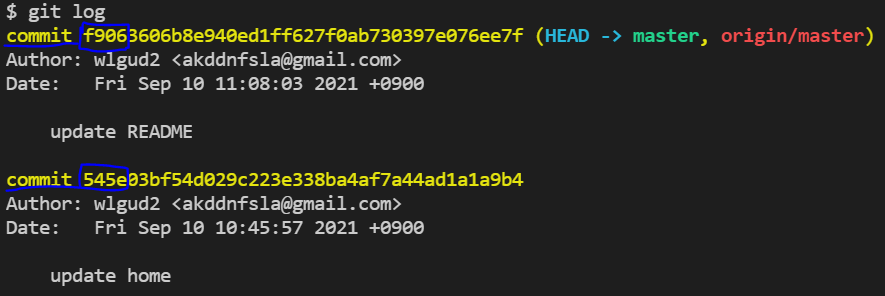
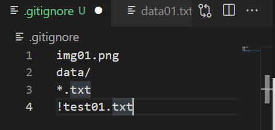
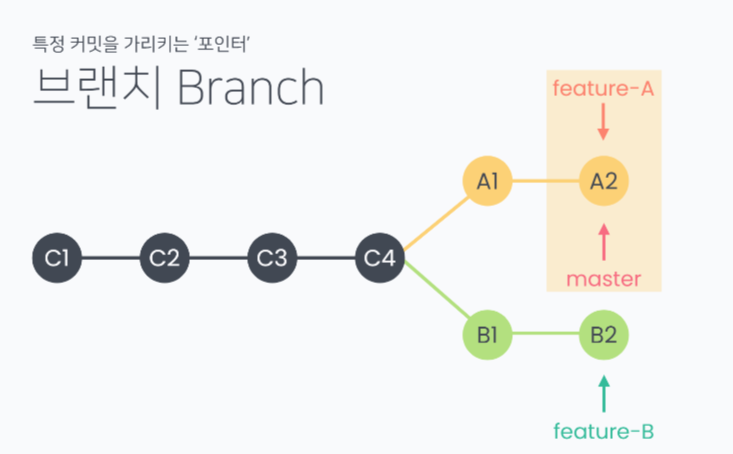
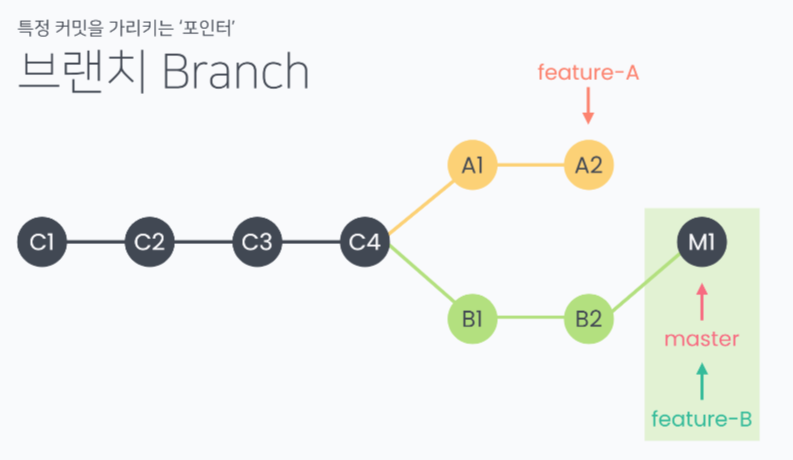

# GIT ADVACED

#### git pull

> a, b가 하나의 repo를 쓸 경우, b가 변경해서 push로 repo로 올려놓은 것을 pull을 통해 a의 local로 가져올 수 있다

- 다른 곳 컴퓨터에서도 내가 올려놓은 repo의 git을 가져와서 수정할 수 있다

1. home에서

   작업하고 remote repo로 올린다

2. class에서

   **git init**	README 끼리 충돌일어날 수 있다-> clone으로

   **git clone** *remote repo 주소*	로 클론 후 작업하고 push

   - 바탕화면에서 bash 열어서 clone하거나

   - 이미 만든 폴더를 쓸 땐, remote repo 주소 뒤에 . 찍기(현재 위치에 clone이라는 뜻) https://github.com/wlgud2/class_repo.git . <<

3. 다시 home으로 와서

   remote에 있는 변경사항(class에서 한)을 home의 local로 pull

   **git pull origin master**

   ​		*origin**의** master branch를 당겨오기*

   ​	*push origin master : origin**으로** local의 master branch를 보내기*

   -> pull받기 전에 작업 후 pull하면 conflict 발생

   ​		->파일에 색 칠해진 부분 지우고 파일이 가져야 할 최종 모습으로 수정

   -> pull 받은 후 작업, add, commit, push

- pull해서 최신 상태인지 확인 -> Already up to date.(remote와 같은 상태이다)

- *github내에서 수정 후* commit 누른다면, local에서 pull해서 사용 가능

  ​		*권장하지X*

---

#### 삭제, 취소, 제외

- **git restore --staged {file}**	git add 취소하기, staging area에서 빼기

- **git restore {file}**	Working Directory(작업 중인 폴더) 변경사항 취소하기

  ​								  *최신 커밋 상태로 돌아가기*

- **git reset --hard {c_id}**	commit 되돌리기, log에서 commit 다음의 4자리

  

  ​	*다시 최신 상태로 돌아가고 싶으면 git pull*

  ​     *hard 외에도 soft, mixed가 있다*

  - hard: working directory, staging area, repository를 과거의 특정 커밋과 똑같이 만든다

  - mixed: staging area를 과거의 특정 커밋과 똑같이 만든다

    ​			 working directory는 작업 중이던 그대로이다. 안바뀜)

  - soft: repository만 과거의 특정 커밋과 똑같이 만든다

    ​	 	HEAD가 과거의 특정 커밋을 가리키도록 한다

- **git remote rm origin**   add origin한 걸 지울 수 있다(연결 끊기)

- **touch .gitignore**	원하지 않는 파일 제외하기

  생성된 .gitignore 파일에 파일/폴더명 적으면 add, commit에서 제외된다

  

  img01.png 	--특정 파일 제외

  data/			   --특정 폴더 내의 모든 파일

  *.txt			     --특정 확장자 모두

  !test01.txt       --모든 확장자 뺐지만, 특정 파일은 예외

  [gitignore 생성 사이트](https://gitignore.io/) 깃 파일이 돌아갈 운영 체재나 언어 적기(windows, macOS, java), 전체 복사 후 내 gitignore 파일에 붙여넣기

---

## Github Flow Models

> github에서 제시하는 방법이 2가지 있다
>
> 두 모델의 차이: 작업자가 해당 프로젝트 저장소에 직접적인 push 권한이 있는지 여부

### Shared Repository Model

> 동일한 저장소를 공유하여 활용하는 방식
>
> 팀원에게도 직접적인 push 권한이 있다

- 팀장: repository owner (project manager)
- 팀원: collaborator (a.k.a no-yeah-contributor)

#### step 0-1. Invite collaborator

> 팀장>팀원 초대
>
> collaborator에 등록 되어야 해당 저장소에 대한 push권한이 주어진다

- remote repo -> settings -> magane access ->invite collaborator

#### step 0-2. Accept Invitation

> 팀원>이메일을 통한 초대 수락

### Fork & Pull Model

> Collaborator에 등록되지 않고, pull request를 통한 협업이 가능
>
> github 기반의 오픈소스 참여 과정에서 쓰이는 방식

- 팀장: repository owner (project manager)
- 팀원: forker (?) (a.k.a no-yeah-contributor)
- branch를 merge해도 될 지 팀장이 검토 후 main으로 merge할 때 사용

#### Forker

test branch를 수정하고 commit, push origin test 후 Pull request(master<-test)

->merge

#### Owner(팀장)

Pull request에서  commits 온 것을 open -> close로 바꿔준다(승인)

---

## Branch

> 특정 커밋을 가리키는 **포인터**

### Merge

- branch 끼리 합치는 것

- **git merge ~**	현재 branch와 ~brach 병합

- 하나의 branch가 없어지는 게 아니라, 두 branch가 같은 커밋을 가리키게 된다

  - #### fast-forward merge

  

  ​		master branch(포인터)를 다른 branch로 이동시키기

  ​		merge 후 따로 commit 만들지 않아도 된다

  ​		conflict가 발생하지 않는 경우에 쓸 수 있다

  - #### merge commit 

    merge를 진행할 때, 다른 commit에서 동일한 이름의 파일을 수정한 경우

    직접 수정하고 commit한다

​		merge 명령 내리면 -> conflict 수정 -> (merge) commit 생성 후 <u>merge 완료</u>

​																*(두 branch가 같은 commit을 가리키게 된다)*

		###### merge commit 예시

master에서 readme에 master01 형성 후 add commit, test branch 형성

test branch(git checkout)에서 test.txt 파일 형성(touch test.txt)

test.txt에 test01형성 후 add commit(test branch가 createtest01 가리킴)

master branch(git checkout)에서 test.txt 파일 형성(touch test.txt)

test.txt에 mastertest01 형성 후 add commit(master branch가 createmastertest01 가리킴)

git merge test(master와 test branch 병합) -> 같은 이름의 파일(test.txt)을 갖고 있기 때문에 conflict 발생-> 최종 합본으로 수정 후 add commit(merge commit)

#### branch 관련 명령어

- git branch	branch 목록. * 붙어 있는 것이 현재 branch
- git branch~	~라는 이름의 branch 생성
- git checkout ~	~branch로 이동
- git checkout -b ~	~라는 브랜치를 생성하고 이동
- git branch -d ~	브랜치 삭제
- **git push origin {branch name}**	branch를 remote repo로 push

***git log --graph***	commit log를 보기 쉽게

***git log --graph --oneline***	한줄로 나타내서 더 보기 쉽게

#### Git Flow

> git을 활용하여 협업하는 흐름으로, branch를 활용하는 전략을 의미한다

|            branch            | 주요 특징                                                    | 예시                                   |
| :--------------------------: | ------------------------------------------------------------ | -------------------------------------- |
|         Master(main)         | 배포 가능한 상태의 코드                                      | LOL 클라이언트 라이브 버전9.23.298.314 |
|        Develop(main)         | - feature branch 로 나눠지거나, 발생된 버그 수정 등 개발 진행 | 다음 패치를 위한 개발 9.24             |
|                              | - 개발 이후 release branch로 갈라짐                          |                                        |
| feature branches(supproting) | - 기능별 개발 브랜치(topic branch)                           | 개발시 기능별 업데이트                 |
|                              | - 기능이 반영되거나 드랍되는 경우 브랜치 삭제                |                                        |
| release branches(supporting) | 개발 완료 이후 qa/test 등을 통해 얻어진 다음 배포 전 minor bug fix 등 반영 | 9.24a, 9.24b, ...                      |
|     Hotfixes(supporting)     | - 긴급하게 반영 해야하는 bug fix                             | 긴급 패치를 위한 작업                  |
|                              | - release branch는 다음 버전을 위한 것이라면, hotfix branch는 현재 버전을 위한 것 |                                        |

- Github flow 기본 원칙
  - master branch는 반드시 배포 가능한 상태여야 한다.
  - feature branch는 각 기능의 의도를 알 수 있도록 작성한다.
  - Commit message는 매우 중요하며, 명확하게 작성한다.
  - Pull Request를 통해 협업을 진행한다.
  - 변경사항을 반영하고 싶다면, master branch에 병합한다.

### OPEN SOURCE

- contributor: fork할 수 있다 (repo를 fork한 이용자가 merge할 수 없다)

​	*collaborator는 remote를 동등하게 공유하기 때문에, 이용자도 merge할 수 있다*

- 타인의 remote를 내 remote로 fork -> 내 remote를 내 local로 clone

=> clone한 관계에서는 push 되지만, 내 local 에서 타인의 remote(fork했던)로는 push할 수 없다

=> local에서 new branch 생성, 작업 후 내 remote로 branch를 올리고 상대 remote로 pr을 보낸다

